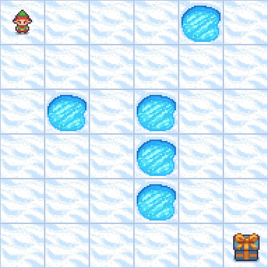
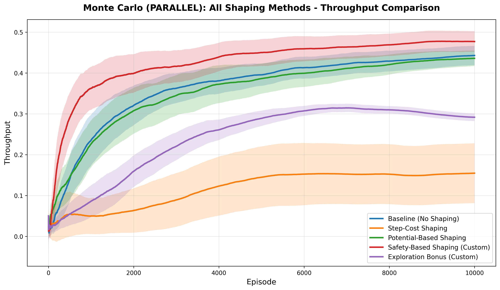
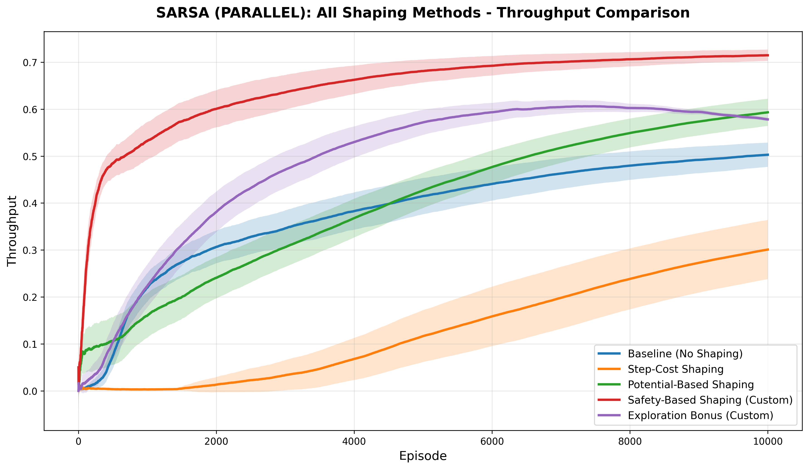
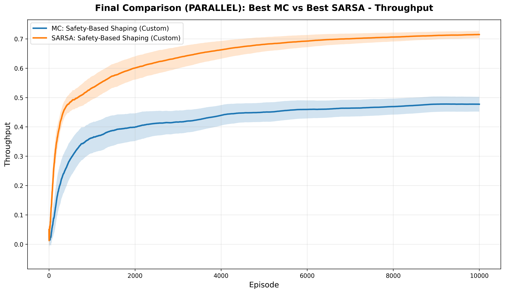
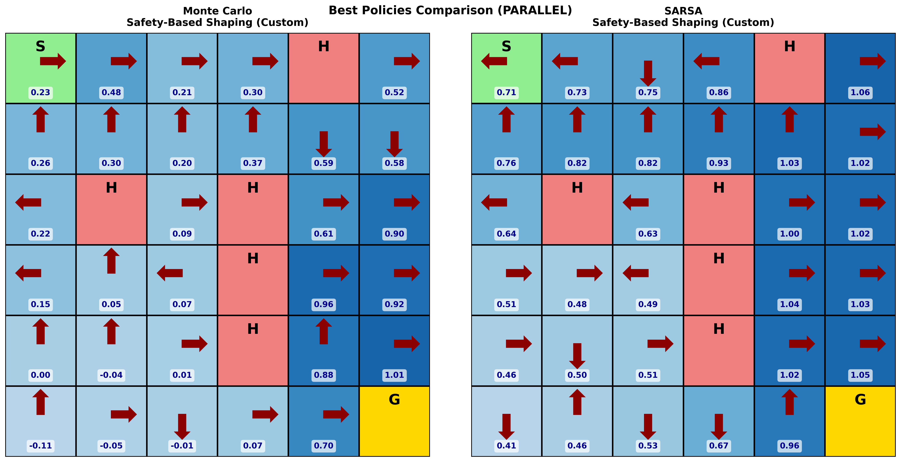
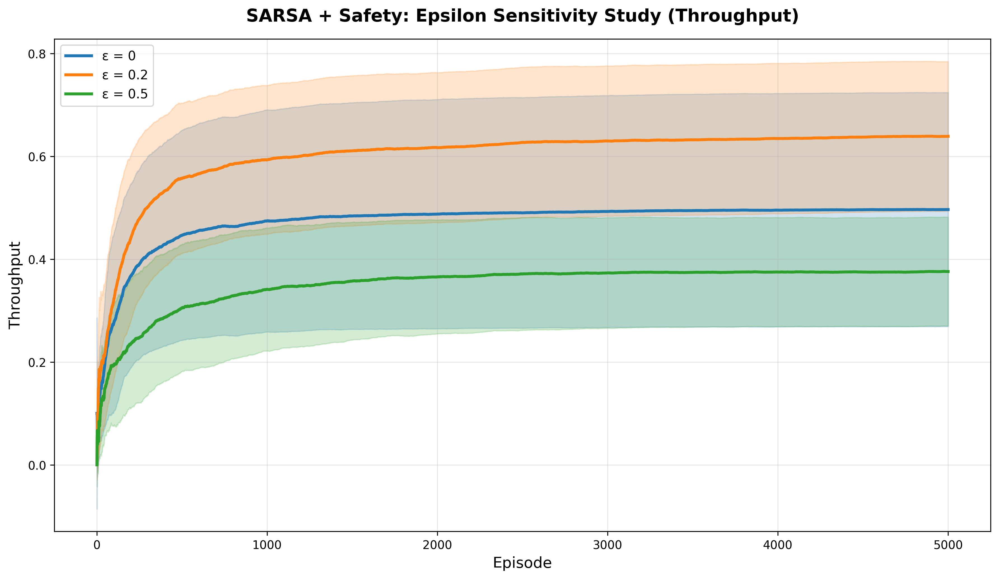
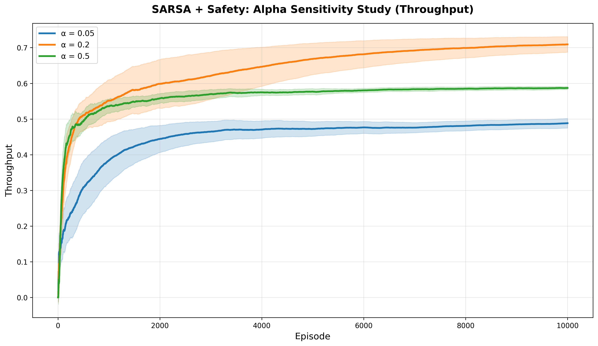

# Reward Shaping Analysis in Reinforcement Learning
### A Comparative Study of Monte Carlo and SARSA

> **Authors:** Ahmad Tawil · Yosef Jirees &nbsp;|&nbsp; January 2026

---

## Overview

This project investigates how **reward shaping** affects reinforcement learning performance in a stochastic grid-world. We implement two fundamental RL algorithms from scratch — **Every-Visit Monte Carlo Control** and **SARSA(0)** — and evaluate five reward shaping strategies on the FrozenLake environment.

**Top result:** SARSA + Safety-Based Shaping achieves **71.46% throughput** — a **+42.1% improvement** over the unguided baseline.

---

## Live Demo — SARSA Safety-Based Agent

<p align="center">
  
</p>
<p align="center"><em>SARSA + Safety-Based Shaping navigating the stochastic FrozenLake (70% action success rate)</em></p>

---

## Environment

<p align="center">
  
</p>

| Parameter | Value |
|-----------|-------|
| Grid Size | 6 × 6 (36 states) |
| Hole Density | 15% (5 holes) |
| Dynamics | Stochastic — 70% success rate |
| Discount Factor | γ = 1.0 |
| Goal Reward | +1 (sparse) |

The agent must navigate from **S** (top-left) to **G** (bottom-right) while avoiding holes. With **30% slip probability**, actions frequently result in perpendicular movement — making this a hard sparse-reward problem.

---

## Reward Shaping Methods

All shaped rewards use the **potential-based form** `F(s,a,s') = β(γΦ(s') − Φ(s))`, which guarantees policy invariance in theory.

| # | Method | Potential Φ(s) | Core Idea |
|---|--------|---------------|-----------|
| 1 | **Baseline** | — | No shaping; sparse +1 at goal only |
| 2 | **Step-Cost** | — | Fixed penalty `c` per step encourages shorter paths |
| 3 | **Potential-Based Distance** | `−d(s)` | Manhattan distance gradient pulls agent toward goal |
| 4 | **Safety-Based (Custom #1)** | `min_h d(s,h)` | Distance from nearest hole — avoids hazards |
| 5 | **Exploration Bonus (Custom #2)** | `−√(count(s)+1)` | Novelty bonus decaying with revisits |

---

## Results

### Monte Carlo — All Shaping Methods

<p align="center">
  
</p>

| Method | Throughput | Avg Return |
|--------|:----------:|:----------:|
| **Safety-Based (Custom)** | **47.71% ± 5.76%** | **0.400 ± 0.490** |
| Baseline | 44.30% ± 5.36% | 0.600 ± 0.477 |
| Potential-Based | 43.60% ± 4.32% | 0.400 ± 0.490 |
| Exploration Bonus | 29.18% ± 2.11% | 0.450 ± 0.497 |
| Step-Cost | 15.47% ± 16.67% | 0.200 ± 0.400 |

---

### SARSA — All Shaping Methods

<p align="center">
  
</p>

| Method | Throughput | Avg Return |
|--------|:----------:|:----------:|
| **Safety-Based (Custom)** | **71.46% ± 2.74%** | **0.650 ± 0.477** |
| Potential-Based | 59.32% ± 6.68% | 0.850 ± 0.357 |
| Exploration Bonus | 57.81% ± 0.89% | 0.400 ± 0.490 |
| Baseline | 50.29% ± 5.90% | 0.800 ± 0.400 |
| Step-Cost | 30.10% ± 14.13% | 0.650 ± 0.477 |

---

### Best MC vs Best SARSA — Final Comparison

<p align="center">
  
</p>

**SARSA + Safety-Based Shaping** outperforms **MC + Safety-Based** by **+49.8%** (71.46% vs 47.71%).  
SARSA's step-level updates let it incorporate shaping signals immediately; MC must wait until episode completion.

---

### Learned Policies

<p align="center">
  
</p>

| | MC + Safety | SARSA + Safety |
|-|:-----------:|:--------------:|
| Q-value range | −0.11 to 1.01 (some negative) | 0.41 to 1.06 (all positive) |
| Confidence | Uncertain near holes | Clear gradients toward goal |

---

### Policy Evolution During Training

<p align="center">
  
</p>

<p align="center"><em>Policy snapshots at episodes 1 · 100 · 1000 · 10,000 — showing convergence from random to optimal</em></p>

---

## Hyperparameter Sensitivity

### ε Sensitivity — SARSA + Safety

<p align="center">
  
</p>

| ε | Throughput |
|:-:|:----------:|
| **0.05** | **48.79% ± 2.16%** |
| 0.2 | 37.89% ± 3.87% |
| 0.5 | 17.98% ± 0.57% |

The environment's 30% slippage provides ~33% effective exploration at ε = 0.05 — sufficient without hurting convergence.

### α Sensitivity — SARSA + Safety

<p align="center">
  
</p>

| α | Throughput |
|:-:|:----------:|
| **0.2** | **70.89% ± 3.54%** |
| 0.5 | 58.68% ± 0.65% |
| 0.05 | 48.79% ± 2.16% |

α = 0.2 balances fast adaptation with stability — critical in a high-variance stochastic environment.

---

## Key Findings

1. **SARSA + Safety-Based Shaping is optimal** — 71.46% throughput, best across all 10 configurations
2. **Shaping effectiveness is algorithm-dependent** — Safety shaping gives SARSA +42.1% but only MC +7.7%
3. **SARSA baseline beats all MC variants** — 50.29% vs 47.71% (best MC), showing TD learning's stochastic advantage
4. **Step-cost backfires** — Penalty accumulation from slippage causes hole-seeking; high variance (±14–17%) reflects bimodal behavior
5. **Potential-based shaping helps SARSA** — +18% over SARSA baseline (59.32% vs 50.29%), though safety guidance is more effective

---

## Algorithms

### Every-Visit Monte Carlo Control
Updates Q-values after **complete episodes** — must wait for full return G before learning:
```
Q(s,a) ← Q(s,a) + α[G − Q(s,a)]     where G = Σ γᵗ Rₜ
```

### SARSA(0)
Updates Q-values after **each step** — immediately bootstraps from next state:
```
Q(s,a) ← Q(s,a) + α[r + γQ(s',a') − Q(s,a)]
```

Both use **ε-greedy action selection** with per-method optimized hyperparameters (selected via grid search over ε ∈ {0.05, 0.1, 0.2}, α ∈ {0.05, 0.1, 0.2}).

---

## Quick Start

**Requirements:** Python 3.8+, 8 GB RAM

```bash
# Clone the repository
git clone https://github.com/AhmadTawil1/reward-shaping-analysis.git
cd reward-shaping-analysis

# Create and activate virtual environment
python -m venv venv
source venv/bin/activate        # Linux / Mac
venv\Scripts\activate           # Windows

# Install dependencies
pip install -r requirements.txt
```

### Run Experiments (in order)

```bash
# 1. Main comparison — all methods, all shapings (~15-30 min, parallel)
python compare_methods_parallel.py

# 2. Epsilon and Alpha sensitivity analysis (~10-15 min)
python hyperparameters_sweep.py

# 3. Beta sensitivity for potential-based shaping (~5-10 min)
python beta_comparison.py

# 4. Policy evolution + animated GIF (~5-10 min)
python test_agent_rendering.py
```

> Use `compare_methods.py` instead for sequential execution (easier debugging, lower memory).

---

## Project Structure

```
reward-shaping-analysis/
├── algorithms/
│   ├── monte_carlo.py              # Every-Visit MC Control
│   └── sarsa.py                    # SARSA(0)
├── env/
│   ├── frozenlake_env.py           # Environment wrapper
│   ├── reward_shaping.py           # All 5 shaping implementations
│   └── metrics_wrapper.py          # Metrics tracking
├── experiments/
│   ├── run_monte_carlo_parallel.py
│   ├── run_sarsa_parallel.py
│   └── ...
├── utils/
│   ├── metrics.py                  # Throughput & return computation
│   ├── plotting.py                 # Learning curve visualization
│   └── visualization.py            # Policy grid visualization
├── results/
│   ├── agent_demos/
│   │   ├── sarsa_safety_best.gif   # Animated agent demo
│   │   └── policy_evolution.png    # Training snapshots
│   └── *.png                       # All experiment plots
├── config.py                       # All hyperparameters (single source of truth)
├── compare_methods_parallel.py     # Main experiment script
├── hyperparameters_sweep.py        # ε/α sensitivity study
├── beta_comparison.py              # β sensitivity study
├── find_best_hyperparameters.py    # Grid search for best params
└── report.tex                      # Full LaTeX report
```

---

## Configuration

All parameters are centralized in `config.py`:

```python
GRID_ROWS, GRID_COLS = 6, 6   # Environment dimensions
HOLE_DENSITY        = 0.15    # 15% holes
IS_SLIPPERY         = True    # Stochastic dynamics
SUCCESS_RATE        = 0.7     # 70% action success probability
FINAL_EPISODES      = 10000   # Episodes per run
FINAL_RUNS          = 20      # Independent runs (for 95% CI)
RANDOM_SEED         = 242     # Reproducibility seed
```

For quick testing: set `TEST_MODE = True` (1000 episodes, 5 runs).

---

## References

1. Ng, A. Y., Harada, D., & Russell, S. (1999). *Policy invariance under reward transformations: Theory and application to reward shaping*. ICML, Vol. 99, pp. 278–287.
2. Sutton, R. S., & Barto, A. G. (2018). *Reinforcement learning: An introduction* (2nd ed.). MIT Press.
